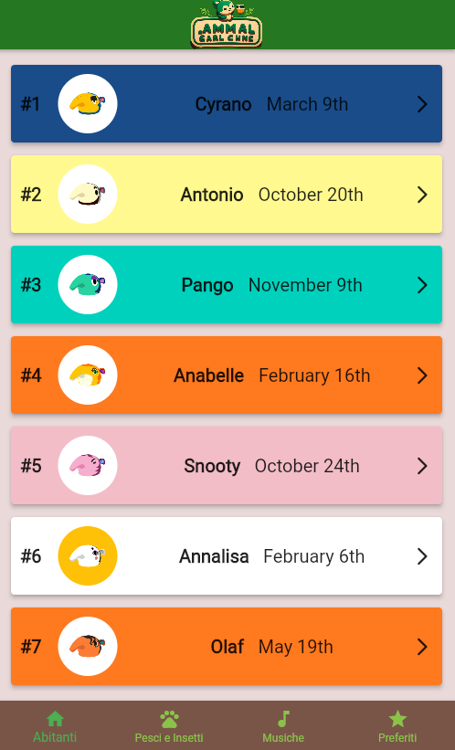
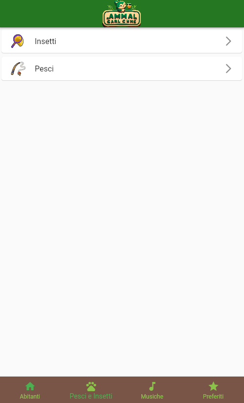
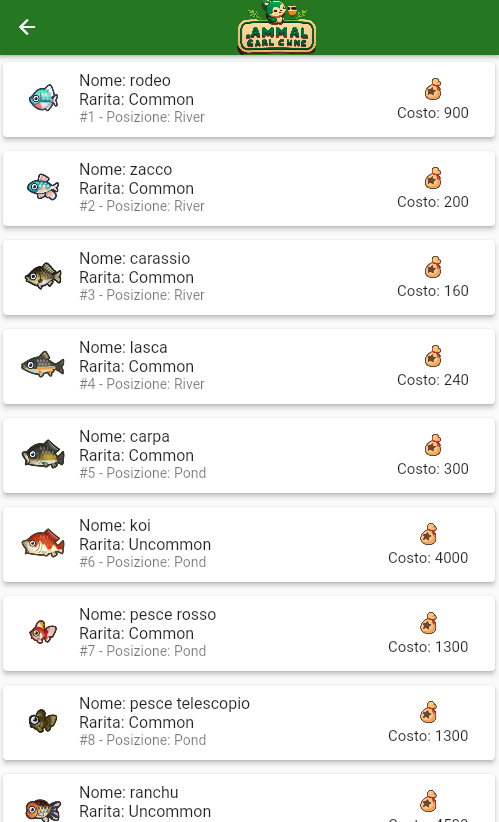
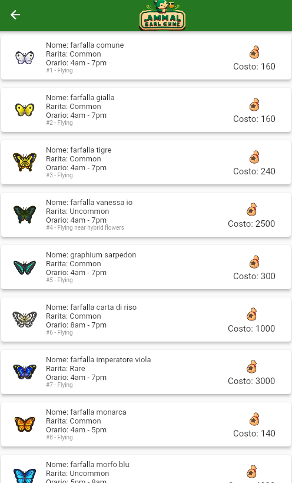
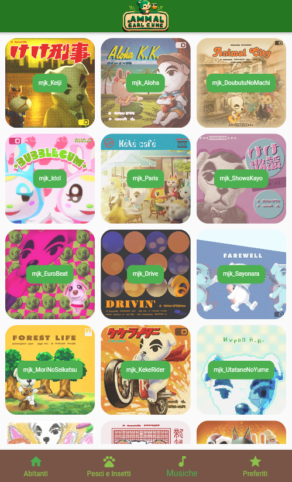
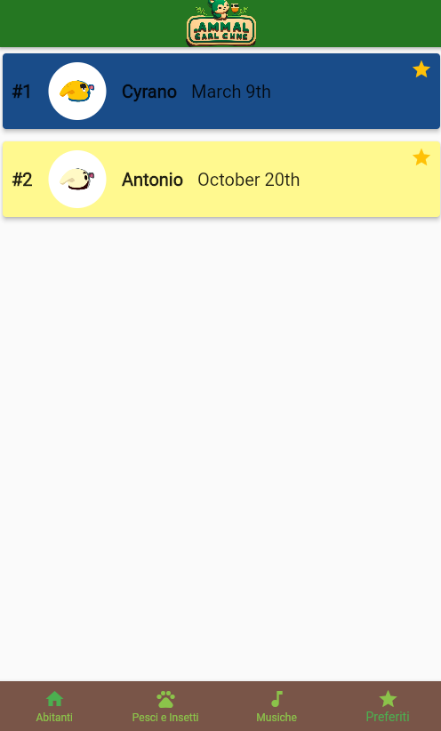

# Introduction

## Info progetto
Nome: **Kevin Attarantato**,  
Matricola: **324564**,  
Titolo: **AnimalCrossPedia**.  

# Spiegazione
L'applicazione che ho sviluppato è un'app che mostra diverse informazioni riguardante il mondo del videogioco 'Animal crossing'.
L'applicazione, programmata in flutter, utilizza le API di [Animal Crossing](http://acnhapi.com/doc) per mostrare una lista di abitanti, insetti e pesci. L'applicazione è stata sviluppata con l'obiettivo di fornire agli appassionati di Animal Crossing un modo semplice e veloce per visualizzare tutte le informazioni sui villager, i bug e i pesci presenti nel gioco. 

La pagina principale dell'applicazione mostra una lista di tutti gli abitanti presenti in Animal Crossing, insieme alla loro immagine, il loro nome e il loro ID. Gli utenti possono scorrere la lista per trovare l'abitante che desiderano. Una volta trovato il villager desiderato, gli utenti possono fare clic sulla sua immagine per visualizzare maggiori informazioni su di esso.

Oltre alla lista degli abitanti, l'applicazione presenta anche una sezione dedicata agli insetti e ai pesci presenti nel gioco. Gli utenti possono scorrere la lista per trovare l'insetto o il pesce che desiderano.

Infine, l'applicazione presenta anche una sezione dedicata alle musiche del gioco. Gli utenti possono ascoltare le varie musiche del gioco, La sezione delle musiche del gioco offre anche l'opportunità di riprodurre la musica in background mentre viene utilizzata l'applicazione.

## Casi d'uso
L'utente appena entrato si troverà nella lista degli abitanti del gioco, quindi l'utente potrà decidere se cliccare un qualsiasi abitante e vederne più dettagli oppure passare alle altre sezioni attraverso la barra di navigazione posta al di sotto della schermata.

Se l'utente, dalla schermata principale, cliccherà la seconda sezione dedicati agli insetti e ai pesci presenti nel gioco potrà scegliere se visualizzare o la lista dei pesci o la lista degli insetti. Da entrambe le schermate sarà possibile visualizzare l'immagine del pesce o dell'insetto con relativi dettagli e prezzo di vendita dal mercante.

L'utente potrà muoversi anche nella terza sezione dedicata alle musiche del gioco dove potrà avviarle ed ascolterle come musica di background durante la navigazione nell'applicazione. Infine l'ultima sezione sarà inzialmente vuota e andrà man mano a contenere eventuali abitanti inseriti tra i preferiti, cliccando l'apposita icona in alto a destra.

## Esperienza utente
La UI è stata pensata per essere il più possibile 'minimal' e di facile utilizzo, sopratutto per i più piccoli, nei devide mobile usando per lo più liste orizzontali, in particolare si è pensato di inserire anche una barra di navigazione in basso in modo tale da facilitare l'accesso ad ogni sezione in modo semplice e anche tenendo il dispositivo mobile con una sola mano, questa barra permetterà di raggiungere tutte le sezioni dell'applicazione: Home, animali, musiche, abitanti preferiti.

Tutti i seguenti screenshot sono stati effettuati in modalità debug:

HomePage

</img>
---
Dettagli abitatante

</img>
---
Sezione dedicata agli animali (pesci e insetti)

</img>
---
Sezione dedicata ai pesci

</img>
---
Sezione dedicata agli insetti

</img>
---
Sezione dedicata alle musiche del gioco

</img>
---
Sezione favoriti

</img>

# Techs
Le tecnologie utilizzate: 
- Le APIs sono state trovate tramite questa [repo](https://github.com/public-apis/public-apis#index) e, come detta all'inizio, si sono sfruttate queste [api](http://acnhapi.com/doc) le quali sono accessibili gratuitamente e senza fare richiesta di un api_key o bearer token;
- La struttura interna dell'app nella folder lib è stata costruita sulla base di quello che di norma faccio utilizzando React, usandolo abitualmente per lavoro quindi inserendo varie folder contenente i componenti grafici ma anche una folder 'utils' contenente tutte le costanti usate nell'applicazione rendendo così il codice più leggibile e manutenibile in quanto in futuro basterà mettere mano ad una di queste costanti per andare a modificare il comportamento dell'applicazione stessa;
- Per salvare le risorse ricevute dalle api e le informazioni quali i favoriti si è deciso di usare __flutter_secure_storage 8.0.0__ invece di un file JSON;
- Un altro pacchetto utilizzato è __provider__, che è servito a poter centralizzare gli stati e i metodi che li aggiornano, per riutilizzarli poi nei vari widget che sfruttano i dati degli stati e i loro cambiamenti. Ho creato in tutto 4 providers, quindi ho utilizzato MultiProviders nella main per poterli gestire al meglio. I providers sono stati divisi in base alle chiamate api che vengono eseguite;
- Per la gestione delle musiche si usato __just_audio 0.9.32__ così da poter gestire la pausa ed la riproduzione delle musiche cliccando sulle rispettive locandine.

Come è possibile visionare nel file pubspec.yml il restanti pacchetto esterno usato è stata la libreria standard di flutter per chiamate APIs (http).

## Tests
Tutti i test sono stati effettuati su un Samsung S10s con Android 12 e su browser, principalmente Chrome.

## Comportamento non intenzionali
Riguardo la funzionalità dei preferiti, questa purtroppo induce un comportamento non corretto da parte dell'app. Questo problema si verifica quando si inseriscono dei villager tra i preferiti, si chiude e si riapre l'applicazione. L'applicazione a questo punto non terrà traccia dei preferiti inseriti precedentemente, questo non tanto per un bug ma per la mancanza di una funzione che vada a salvare i preferiti e che gli ricarichi al nuovo avvio dell'app. 

Ponendosi in un caso reale probabilmene questo aspetto dovrebbe avere la massima priorità in quanto va a minare la user experience.

Purtroppo durante i test ho provato a lanciare l'app senza connessione alla rete, nonostante l'app abbia nella cache i dati di tutte le immagini non vengono caricate correttamente segnalando un errore di irraggiungibilità, l'unico modo per risolvere il problema è riconnettersi alla rete.
Questo non permette all'applicazione di lavorare al meglio.
Un'altro problema correlato all'utilizzo della rete internet è il fatto che anche le musiche, nell'aposita sezione, non saranno riproducibili, per la stessa ragione delle immagini. 

